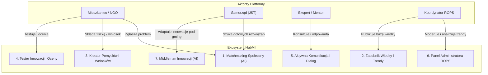

# 🌟 HubMI – Małopolski Hub Innowacji Społecznych

> **Cyfrowe serce innowacji społecznych dla Województwa Małopolskiego**
> Prototyp platformy opracowany w ramach wyzwania **Regionalnego Ośrodka Polityki Społecznej w Krakowie (ROPS)** na hackathonie **HackYeah 2026**.

[](https://kotlinlang.org/)
[](https://ktor.io/)
[](https://react.dev/)
[](https://www.typescriptlang.org/)
[](https://www.keycloak.org/)
[](https://www.mongodb.com/)
[](https://www.w3.org/WAI/standards-guidelines/wcag/)
[-brightgreen?logo=ollama&logoColor=white)](https://ollama.com/)

---

## 🎯 Wizja i Cel Projektu

Województwo Małopolskie mierzy się z kluczowymi wyzwaniami społecznymi: **starzeniem się społeczeństwa, samotnością, kryzysem zdrowia psychicznego dzieci i młodzieży, wykluczeniem cyfrowym oraz depopulacją mniejszych gmin**. Regionalny Ośrodek Polityki Społecznej w Krakowie posiada bogate portfolio ponad 200 innowacji społecznych, jednak brakowało centralnego narzędzia, które spinałoby cały cykl życia innowacji:
$$\text{Diagnoza problemu} \longrightarrow \text{Kreator i rozwój} \longrightarrow \text{Pilotaż i testy} \longrightarrow \text{Adaptacja do samorządów} \longrightarrow \text{Upowszechnienie}$$

**HubMI** to nowoczesna, w pełni dostępna cyfrowo i bezpieczna platforma, która łączy mieszkańców, organizacje pozarządowe (NGO), jednostki samorządu terytorialnego (JST), ekspertów oraz koordynatorów ROPS w jeden spójny, współpracujący ekosystem.

---

## 🏆 Kluczowe Wyróżniki i Wartość Rozwiązania

HubMI został zaprojektowany i zbudowany jako **w pełni funkcjonalny, gotowy do wdrożenia prototyp (MVP)**, odpowiadający bezpośrednio na kryteria oceny ROPS Kraków:

1. **Kompletność (100% modułów z wyzwania):**
   - Zrealizowaliśmy **wszystkie 7 modułów** (obligatoryjny Matchmaking oraz 6 dodatkowych modułów punktowanych), w tym zaawansowane moduły bonusowe: **Asystenta Kreatora AI** i **Middlemana Innowacji**.
2. **Prywatność i 100% lokalne AI:**
   - Żadne dane mieszkańców ani urzędów **nie opuszczają infrastruktury Małopolski**. Cały silnik AI (hybrydowy BM25 + wektory `bge-m3` oraz model językowy Bielik/LLM) działa lokalnie wewnątrz sieci ROPS przez Ollamę.
3. **Prawdziwa dostępność cyfrowa (WCAG 2.1 AA od fundamentów):**
   - Dostępność nie była „doklejana na końcu” — każdy widok został oprogramowany semantycznym HTML-em, przetestowany czytnikami ekranu i zautomatyzowanym audytem `axe-core`. Zawiera dedykowany tryb wysokiego kontrastu, skalowanie do 200%, wsparcie klawiatury i obowiązkowe transkrypcje dla materiałów multimedialnych.
4. **Architektura Single Source of Truth (Kotlin Multiplatform):**
   - Współdzielony kontrakt API (`:core`) kompilowany jednocześnie na JVM (serwer Ktor) i JavaScript/TypeScript (`:web-client`). Zmiana w API natychmiast weryfikuje poprawność typów po stronie frontendu w fazie kompilacji.
5. **Czysta inżynieria funkcyjna (Arrow-kt):**
   - Architektura oparta o domenowe typy wartościowe, `Either<DomainError, A>` i brak niekontrolowanych wyjątków runtime.
6. **Realistyczny model wdrożeniowy i niskie koszty:**
   - Opracowaliśmy pełny bilans kosztowy dla Województwa Małopolskiego ([`docs/COSTS.md`](docs/COSTS.md)). Koszt infrastruktury pilotażowej to zaledwie ~240 €/miesięcznie (lub ~40–80 € w wariancie CPU).

---

## 🧩 Przegląd Zrealizowanych Modułów

Platforma HubMI wdraża pełne spektrum modułów zdefiniowanych przez ROPS:



### 1. 🔍 Matchmaking Społeczny (Moduł Obligatoryjny)
- **Problem:** Obywatele i pracownicy JST nie znają fachowego nazewnictwa innowacji (np. szukają „jak pomóc samotnej babci na wsi”, a rozwiązaniem jest „teleopieka sąsiedzka”).
- **Rozwiązanie HubMI:**
  - Hybrydowe wyszukiwanie: połączenie silnika pełnotekstowego BM25 z polską normalizacją oraz wektorów semantycznych (`bge-m3`).
  - **Explainable AI (XAI):** Użytkownik otrzymuje precyzyjne wyjaśnienie dlaczego innowacja pasuje do jego potrzeb.
  - **Ochrona prywatności:** Automatyczne usuwanie danych wrażliwych (PESEL, nr telefonu, e-mail) przed analizą.
  - **Graceful Degradation:** W razie braku GPU/Ollamy system natychmiast i bezbłędnie przełącza się na lokalny silnik BM25.
  - Każde wyszukanie zasila anonimową bazę potrzeb regionu.

### 2. 📚 Zasobnik Wiedzy (Biblioteka Innowacji, Wyzwania, Materiały)
- Katalog innowacji społecznych Małopolski z podziałem na obszary, grupy docelowe i etapy dojrzałości.
- Baza wyzwań regionalnych powiązana z gminami Małopolski.
- Baza materiałów edukacyjnych (broszury, nagrania wideo z obowiązkową transkrypcją/napisami zgodnie z ustawą o dostępności cyfrowej).

### 3. 💡 Kreator Pomysłów i Generator Wniosków Grantowych
- **Fiszka innowacji:** Intuicyjny, 3-krokowy kreator (istota, adresaci, zasoby) z podpowiedziami z Canv Innowacji Społecznych.
- **Generator Wniosków ROPS:** Wdrożony oficjalny wzór wniosku grantowego (Załącznik nr 3 do regulaminu ROPS) z obsługą 3 profili wnioskodawców (osoba fizyczna, podmiot, grupa nieformalna do 5 partnerów).
- **Rygorystyczna walidacja domenowa:** Sumy kontrolne NIP, REGON, KRS, limity budżetowe (zabezpieczone przed przepełnieniem liczb), harmonogram (max 3 mies. przygotowania, max 9 mies. testów).
- **Autosave i bezpieczeństwo:** Bezpieczne zapisywanie szkiców na serwerze z optymistyczną blokadą współbieżności (`updatedAt`).

### 4. 🧪 Tester Innowacji i Ewaluacja Społeczna
- Zgłoszenia podmiotów i mieszkańców do testowania innowacji w lokalnych warunkach.
- Zbieranie feedbacku: ocena słowna (1–5), uwagi i propozycje usprawnień.
- Automatyczne wyliczanie wskaźników zadowolenia i ochrona przed podwójnym zgłoszeniem.

### 5. 💬 Platforma Aktywnej Komunikacji i Powiadomienia
- Bezpieczny, trójstronny kanał dialogu: Innowator ↔ ROPS ↔ Ekspert/Mentor.
- Centrum powiadomień w czasie rzeczywistym z licznikiem nieprzeczytanych wiadomości, filtrowaniem i historią.
- Czytelny dla czytników ekranu dzwonek z powiadomieniami (`aria-live="polite"`).

### 6. 🛡️ Panel Administratora i Zaawansowane Trendy
- Centralne biuro moderacji: kolejka pomysłów, weryfikacja zgłoszeń testerów, zarządzanie publikacją materiałów.
- **Agregacja Trendów Regionalnych:** Analiza zgłaszanych potrzeb w ujęciu czasowym, terytorialnym (gminy) i tematycznym.
- **Privacy Threshold (K-Anonymity):** Ochrona danych w małych gminach – agregacje poniżej określonego progu są maskowane, aby uniemożliwić deanonimizację mieszkańców.

### 7. 🤖 Middleman Innowacji i Asystent Kreatora
- **Asystent Kreatora:** Interaktywny doradca pomagający innowatorowi rozwinąć pomysł na podstawie metodologii inkubacji ROPS.
- **Middleman Innowacji:** Generator planów adaptacji innowacji do specyfiki konkretnej instytucji (np. przekształcenie pomysłu z dużej aglomeracji na realia wiejskiego MOPS-u z budżetem 50 000 zł i 2 pracownikami).
- **Streaming SSE (Server-Sent Events):** Wyniki generowane są strumieniowo, krok po kroku na oczach użytkownika.
- **Kolejka weryfikacji:** Każdy plan wygenerowany przez AI ma widoczną etykietę i trafia do akceptacji merytorycznej przez eksperta ROPS.

---

## 🏛️ Architektura i Rozwiązania Techniczne

```
HubMI/
├── core/         # Kotlin Multiplatform: kontrakty DTO, walidacje, trasy Ktor Resources
├── server/       # Backend: Ktor, Koin, MongoDB, silnik hybrydowy (BM25 + Ollama), SSE
├── web-client/   # Kotlin/JS: klient HTTP eksportowany jako biblioteka npm (hubmi-client)
├── web/          # Frontend: React 19, TypeScript, Mantine UI, Vite, testy vitest-axe
├── keycloak/     # Tożsamość: Realm OpenID Connect (PKCE, role user/expert/admin)
├── scripts/      # Narzędzia developerskie i automatyzacja wdrożeń (dev-infra)
└── docs/         # Kompletna dokumentacja: architektura, koszty, matchmaking, zadania
```

### Stos Technologiczny

| Warstwa | Wybrana technologia | Dlaczego właśnie to? |
|:---|:---|:---|
| **Współdzielony Kontrakt** | Kotlin Multiplatform (`:core`) | 100% spójności typów między backendem a klientem webowym; zmiana w API kompiluje lub psuje obie strony jednocześnie. |
| **Backend** | Ktor 3.1 + Koin DI | Niezwykle lekki, asynchroniczny silnik na korutynach; wysoka przepustowość przy minimalnym zużyciu pamięci RAM. |
| **Baza Danych** | MongoDB 8.0 (Replica Set) | Elastyczny model dokumentowy dla innowacji, wniosków i adaptacji; wbudowane indeksy i agregacje dla trendów. |
| **Tożsamość i Auth** | Keycloak 26.8 (OIDC + PKCE) | Standard bezpieczeństwa klasy korporacyjnej; obsługa ról `user`, `expert`, `admin`; brak haseł w bazie aplikacji. |
| **Sztuczna Inteligencja** | Ollama (`bge-m3`, Bielik / LLM) | 100% lokalna suwerenność danych (on-premise); brak zewnętrznych zależności chmurowych; wysoka precyzja języka polskiego. |
| **Frontend** | React 19 + TypeScript + Mantine | Pełna kontrola nad drzewem DOM dla standardu WCAG 2.1 AA; nowoczesny, responsywny interfejs z dostępem do tysięcy komponentów. |
| **Testy i Jakość** | Vitest + Axe-core + Testcontainers | 126+ testów frontendu, testy backendu na rzeczywistym kontenerze MongoDB, automatyczna analiza a11y w CI. |

## ♿ Dostępność Cyfrowa (WCAG 2.1 AA)

Dostępność w HubMI jest filarem projektu (kryterium za 20%):
- **Pełna semantyka:** Landmarki HTML5 (`<header>`, `<nav>`, `<main>`, `<footer>`), prawidłowe nagłówki `h1`–`h4`.
- **Nawigacja klawiaturą:** Każda akcja dostępna bez użycia myszy; logiczna kolejność tabulacji, widoczny wskaźnik skupienia (focus ring), link *„Przejdź do treści głównej”*.
- **Wsparcie dla czytników ekranu:** Dynamiczne komunikaty w regionach `aria-live="polite"`, powiązanie pól formularzy z opisami błędów przez `aria-describedby`, tabele z nagłówkami `th[scope="col"]`.
- **Ułatwienia percepcyjne:** Przełącznik wysokiego kontrastu, skalowanie fontów do 200% bez utraty zawartości i poziomego paska przewijania, respektowanie `prefers-reduced-motion`.
- **Wymóg dostępności multimediów:** Formularz dodawania materiałów wideo w panelu admina blokuje publikację materiałów pozbawionych napisów lub transkrypcji tekstowej.

---

## 🚀 Szybki Start (Uruchomienie Lokalne)

### Wymagania wstępne
- **Docker** oraz **Docker Compose**
- **JDK 21+** (np. Azul Zulu lub Temurin)
- **Node.js 22+** (rekomendowane 24)

### Wariant 1: Uruchomienie całości w Dockerze

Wystarczy jedno polecenie, aby uruchomić bazę MongoDB, Keycloaka, zsynchronizować infrastrukturę, uruchomić backend oraz frontend za reverse proxy Nginx:

```bash
docker compose up -d --build
```

Aplikacja będzie dostępna pod adresami:
- **Aplikacja Web (Frontend):** [http://localhost:3000](http://localhost:3000)
- **API Backend (Ktor):** [http://localhost:8080](http://localhost:8080)
- **Panel Keycloak:** [http://localhost:8081](http://localhost:8081) (logowanie do konsoli: `admin` / `admin`)

Konta testowe (hasło identyczne jak login):
- `user` / `user` – Mieszkaniec / Innowator
- `expert` / `expert` – Ekspert / Doradca
- `admin` / `admin` – Koordynator ROPS Kraków

---

### Wariant 2: Praca developerska z Hot-Reloadem

1. **Uruchom infrastrukturę bazodanową i Keycloaka:**
   ```bash
   # Linux / macOS:
   ./scripts/dev-infra.sh

   # Windows:
   scripts\dev-infra.bat
   ```

2. **Zbuduj bibliotekę klienta Kotlin/JS:**
   ```bash
   ./gradlew :web-client:jsBrowserProductionLibraryDistribution
   ```

3. **Uruchom serwer backendowy:**
   ```bash
   ./gradlew :server:run
   ```

4. **Uruchom frontend w trybie deweloperskim:**
   ```bash
   cd web
   npm install
   npm run dev -- --force
   ```
   Aplikacja deweloperska uruchomi się pod adresem [http://localhost:5173](http://localhost:5173) z aktywnym proxy do backendu.

---

### Wariant 3: Aktywacja Silnika Wektorowego AI

Domyślnie system działa w trybie hybrydowym z automatycznym fallbackiem na BM25. Aby włączyć pełne embeddingi wektorowe:

```bash
# Zainstaluj Ollamę lokalnie (macOS / Linux / Windows)
ollama pull bge-m3
```
Serwer automatycznie wykryje działającą instancję Ollamy pod adresem `localhost:11434` i przełączy się na wektorowy ranking semantyczny.

---

### Wariant 4: Demo bez backendu (Mock HubApi w przeglądarce)

Frontend potrafi działać w autonomicznym trybie demonstracyjnym na mocku `HubApi` (dane przykładowe z seedu, zmiany zapisują się w `localStorage`), bez konieczności uruchamiania serwera, bazy Mongo i Keycloaka:

```bash
cd web
npm run dev:demo
```
Aplikacja demo pod GitHub Pages publikowana jest automatycznie przez workflow [`.github/workflows/demo.yml`](.github/workflows/demo.yml); szczegóły w [`docs/DEMO.md`](docs/DEMO.md).

---

## 🧪 Testy i Zapewnienie Jakości

Projekt posiada pełną automatyzację testów w pipeline CI:

```bash
# Weryfikacja backendu (testy jednostkowe, integracyjne z Mongo + linter KtLint):
./gradlew backendCheck

# Automatyczne formatowanie kodu Kotlin:
./gradlew ktlintFormat

# Testy frontendu (126 testów Vitest + testy dostępności vitest-axe):
cd web
npm test

# Statyczna analiza kodu i zgodności z WCAG (ESLint jsx-a11y + TypeCheck):
npm run lint
npm run build
```

---

## 💰 Koszty Wdrożenia i Utrzymania

Szczegółowa analiza wdrożeniowa znajduje się w dokumencie [`docs/COSTS.md`](docs/COSTS.md).

- **Skala Małopolski:** 3,43 mln mieszkańców, 182 gminy, setki organizacji pozarządowych.
- **Infrastruktura:** Dzięki wydajności Ktor i optymalizacjom indeksów pamięciowych, pojedynczy serwer o zasobach **4 vCPU i 16 GB RAM** z zapasem obsługuje ruch regionalny.
- **Koszty miesięczne:**
  - Wariant bez dedykowanego GPU (Ollama CPU / BM25): **~40–80 € / mies.**
  - Wariant pełny z kartą GPU w chmurze europejskiej (np. Hetzner RTX 4000 Ada): **~240 € / mies. (~12 000 zł rocznie)**.
  - Zero opłat licencyjnych za oprogramowanie (100% Open Source).
